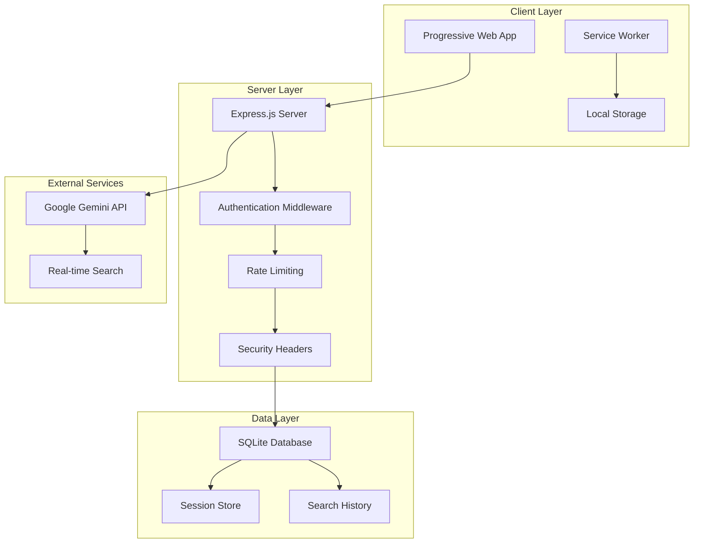

# Tool Finder - Smart Tool Recommendation Platform


## Project Overview

Tool Finder is an AI-powered smart tool recommendation platform designed to eliminate tool discovery fatigue for students, researchers, and knowledge workers. The application leverages Google's Gemini 2.5 Flash API with search grounding to provide personalized, evidence-backed tool recommendations based on specific user requirements.

## 🎯 Problems Solved

- **Tool Discovery Fatigue**: Eliminates hours spent researching options manually
- **Decision Paralysis**: Provides clear, ranked recommendations with confidence scores
- **Wasted Resources**: Prevents time and money spent on unsuitable tools
- **Trial and Error**: Offers use-case specific recommendations

## 👥 Target Users

- 📚 **Students**: Finding academic and productivity tools within budget constraints
- 🔬 **Researchers**: Discovering specialized research software and analysis tools
- 💼 **Knowledge Workers**: Selecting professional tools for specific business tasks
- 🚀 **Startups**: Making informed tool decisions for growing teams

## 🚀 Key Features

### Core Functionality
- ✨ **AI-Powered Recommendations**: Intelligent matching using Google Gemini API
- 🔍 **Smart Search Grounding**: Real-time search integration for accuracy
- 📊 **Confidence Scoring**: Transparent quality metrics (0-100%)
- 💰 **Budget-Aware Filtering**: Recommendations within specified price ranges
- 🔐 **Privacy-First Options**: GDPR compliant and local/on-premise solutions
- 📱 **Progressive Web App**: Offline functionality and native app experience

### User Experience
- 🎨 **Modern UI**: Glass morphism design with gradient animations
- 📊 **Dashboard Analytics**: Search history and usage statistics
- 🔑 **API Key Management**: Secure, encrypted storage of user credentials
- 📱 **Responsive Design**: Optimized for desktop, tablet, and mobile devices
- ⚡ **Fast Performance**: Optimized loading and caching strategies

## 🛠️ Technical Stack

### Backend Technologies
- **Runtime**: Node.js 14+ with Express.js 4.18.2
- **Database**: SQLite3 5.1.6 with foreign key constraints
- **Authentication**: express-session + bcryptjs (12 salt rounds)
- **Security**: helmet, CORS, express-rate-limit, input validation
- **AI Integration**: Google Gemini 2.5 Flash API with real-time search
- **API**: RESTful endpoints with comprehensive error handling

### Frontend Technologies
- **Core**: HTML5, CSS3, JavaScript ES6+ with modern APIs
- **Styling**: Tailwind CSS 3.x with custom animations
- **Icons**: Font Awesome 6.4.0 for consistent iconography
- **PWA**: Service Worker, Web App Manifest, offline caching
- **Animations**: CSS keyframes, transforms, and transitions

### Infrastructure & DevOps
- **Containerization**: Docker with multi-stage builds
- **Orchestration**: Docker Compose with health checks
- **Environment**: dotenv for configuration management
- **Process Management**: PM2 ready for production deployment
- **Database**: Automatic schema migration and initialization

## 📦 Installation & Setup

### Prerequisites
- **Node.js**: Version 14.0.0 or higher ([Download](https://nodejs.org/))
- **npm**: Comes with Node.js installation
- **Google Gemini API Key**: Required for AI functionality ([Get API Key](https://makersuite.google.com/app/apikey))

### 🚀 Quick Start Guide

#### Option 1: Automated Setup (Recommended)

**Windows:**
```batch
# Navigate to project directory and run:
start.bat
```

**Unix/Linux/macOS:**
```bash
# Make script executable and run:
chmod +x start.sh
./start.sh
```

The startup scripts automatically:
- ✅ Verify Node.js installation and version
- ✅ Install all required dependencies
- ✅ Create database directory structure
- ✅ Initialize SQLite database with proper schema
- ✅ Generate default environment configuration
- ✅ Start the development server

#### Option 2: Manual Installation

```bash
# 1. Install dependencies
npm install

# 2. Initialize database
npm run init-db

# 3. Create environment file
cp .env.example .env
# Edit .env file with your settings

# 4. Start the application
npm start        # Production mode
npm run dev      # Development mode with nodemon
```

### 🔧 Environment Configuration

Create a `.env` file in the project root:

```env
# Application Settings
NODE_ENV=development
PORT=3000
FRONTEND_URL=http://localhost:3000

# Security Configuration
SESSION_SECRET=change-this-secure-key-in-production
BCRYPT_ROUNDS=12

# Database Configuration
DB_PATH=./database/tool-finder.db

# Optional: Global Gemini API Key
# GEMINI_API_KEY=your-api-key-here
```

### 🐳 Docker Deployment

```bash
# Build and run with Docker Compose
docker-compose up --build

# Run in background
docker-compose up -d

# View logs
docker-compose logs -f

# Stop services
docker-compose down
```

### 🌐 Accessing the Application

1. Open your browser and navigate to `http://localhost:3000`
2. Create a new account or login
3. Configure your Gemini API key in the dashboard
4. Start getting AI-powered tool recommendations!

## 📖 Usage Guide

### Getting Started
1. **Registration**: Create account with username and secure password
2. **API Key Setup**: Add your Google Gemini API key in dashboard settings
3. **First Search**: Describe your task and specify requirements
4. **Review Results**: Analyze recommendations with confidence scores
5. **Save & Compare**: Save searches and compare different tools

### Search Best Practices
- Be specific about your use case and requirements
- Include budget constraints for relevant recommendations
- Specify platform preferences (Windows, macOS, Linux, Web)
- Mention privacy requirements if applicable
- Add context about team size or usage scale

## 🔒 Security Features

- **Password Security**: bcrypt hashing with configurable salt rounds
- **Session Management**: Secure HTTP-only cookies with expiration
- **API Key Encryption**: User API keys stored securely
- **Rate Limiting**: Protection against abuse (100 requests/15 minutes)
- **Input Validation**: Server-side validation for all user inputs
- **CSRF Protection**: Session-based CSRF protection
- **Security Headers**: Helmet.js for security header management

## 🏗️ Architecture Overview



## 📊 API Documentation

### Authentication Endpoints
- `POST /api/auth/register` - User registration
- `POST /api/auth/login` - User login
- `POST /api/auth/logout` - User logout
- `GET /api/auth/status` - Authentication status

### Search Endpoints
- `POST /api/search/recommend` - Get AI recommendations
- `POST /api/search/save` - Save search results
- `GET /api/search/history` - Get search history
- `GET /api/search/:id` - Get specific search

### User Management
- `GET /api/user/profile` - Get user profile
- `GET /api/user/stats` - Get user statistics
- `PUT /api/user/api-key` - Update API key
- `DELETE /api/user/api-key` - Remove API key

## 🚨 Troubleshooting

### Common Issues

**Port Already in Use**
```bash
# Change port in .env file or kill existing process
lsof -ti:3000 | xargs kill -9
```

**Database Permission Errors**
```bash
# Ensure write permissions to database directory
chmod 755 database/
```

**API Key Issues**
- Verify your Gemini API key is valid
- Check API key permissions and quotas
- Ensure network connectivity to Google APIs

**Node.js Version Issues**
```bash
# Check Node.js version
node --version
# Should be 14.0.0 or higher
```

## 🤝 Contributing

This is a prototype project for the Eureka Juniors program. While not actively accepting contributions, feedback and suggestions are welcome.

## 📄 License

MIT License - See LICENSE file for details.

## 📧 Contact & Support

**Developer**: Abhi Ram  
**ID**: Ej25n566393  
**Email**: a.m.s.s.abhiram492@gmail.com  
**Team**: EJ25T518480 - "Abhi's team"  
**Program**: Eureka Juniors Stage 2 Intermediate Task  

---

⭐ **Built with passion for solving real-world problems through AI-powered solutions**